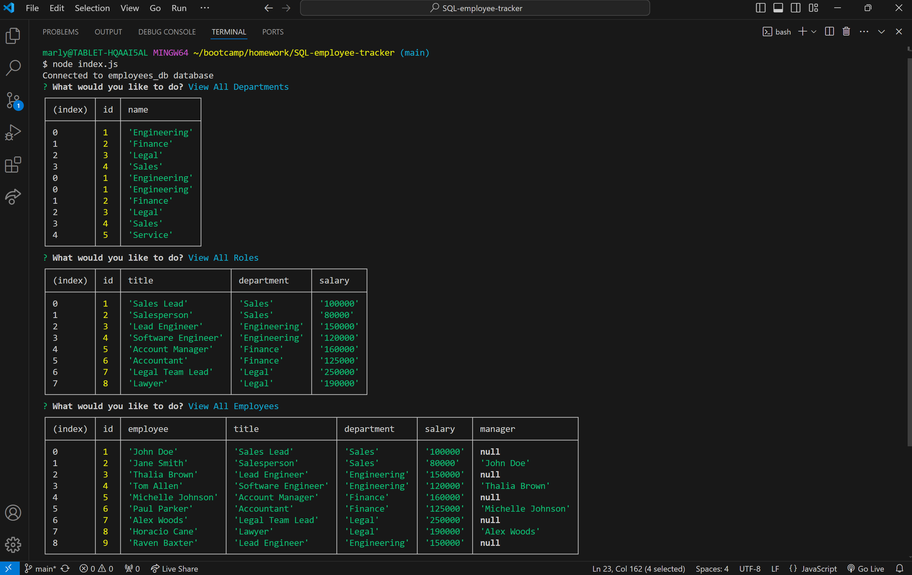

# SQL-Employee-Tracker

## Description

The purpose of this application was to build a command-line application from scratch to manage a company's employee database. This allows the user to add new departments, new roles and new employees. The updated information can then be viewed by the user after selecting the option to either view all departments, roles or employees. This project allowed me to advance my knowledge of a PostgreSQL database and to how to use a pg package in order to perform queries.

## Usage

Once the user starts the application they can either choose the option to view all departments, view all roles, view all employees, add a department, add a role, add an employee, or update an employee role. If the user chooses to view all departmnets a table displaying all department names and department ids is shown. A new department can also be added if the user selects that option. After the user selects the option to view all roles, the table is then formatted to include the job title, role id, corresponding department for that role, and the salary for that role. The user can also add a role to this table by selecting the option to add a role. The user is also able to view the employee's first name, last name, job titles, department, salaries and the managers for each employee after they choose the option to view all employees. In addition to this a new employee can be added if that option is selected or the role of the employee can be updated if that option is selected. 

<a href="https://drive.google.com/file/d/1Io9YZhzWbBhm06-zLxPFhgf8dL6wupZP/view?usp=sharing">Walkthrough Demo</a>

    

